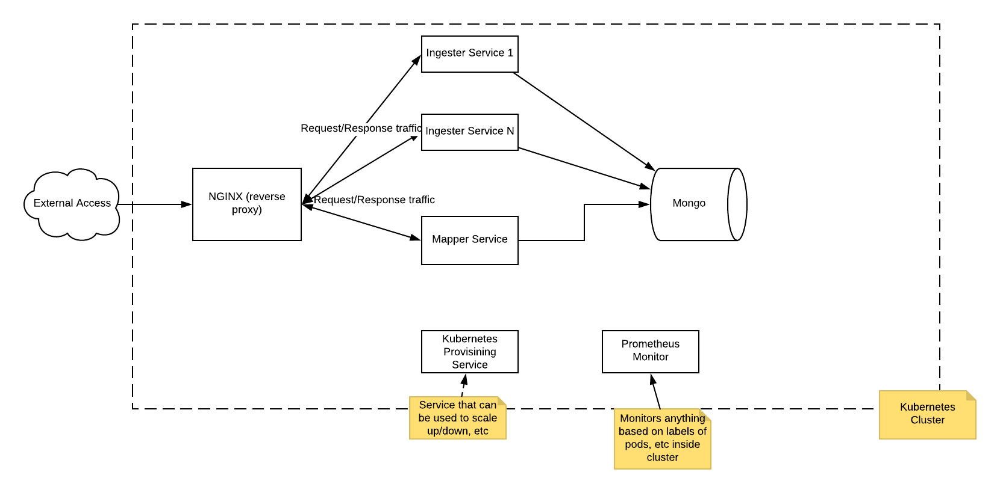
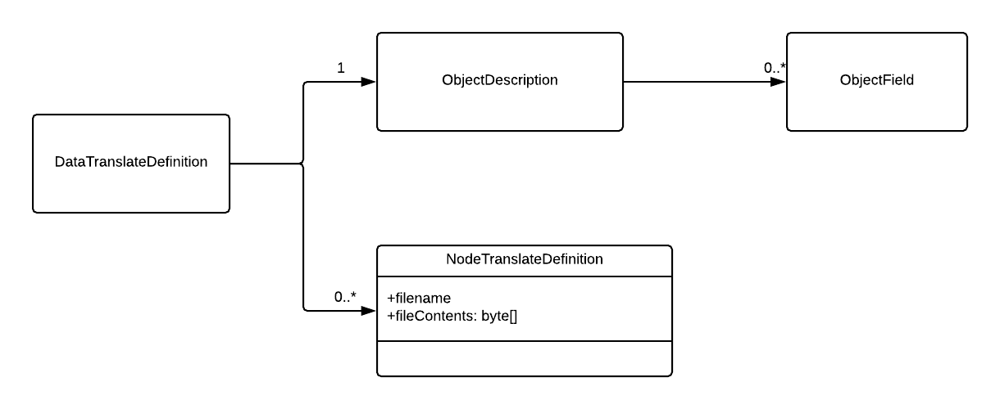
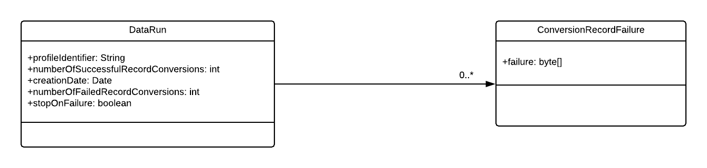
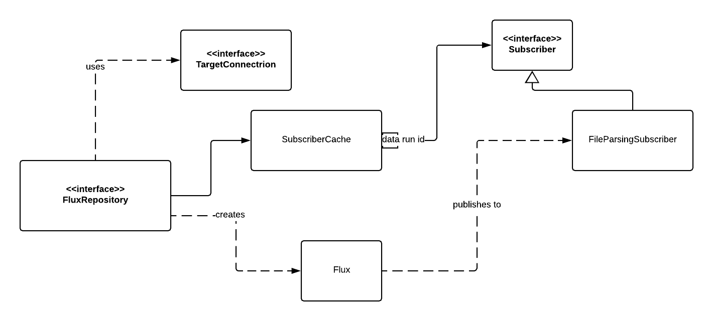

#@Project : Universal Translator Prototype



The goal fo this project is to demonstrate some of the technologies that can be utilized from the CNF Computing Project
(https://www.cncf.io/projects/). These technologies faciliate portability between cloud vendors without locking into
their particular platforms.

This prototype represents a scalable data translator Theinitial development time for this project was about one week. 
There are a few known missing parts:

- Significant unit tests need to be added to improve code coverage.
 

#Project Prerequisites

- Java 11 -- On a mac, brew cask install java will install java 11.

- Maven - On a mac, brew install maven

- Docker and Kubernetes must be installed as well. Mac has Docker for mac that con be utilized. Instructions here:  
https://store.docker.com/editions/community/docker-ce-desktop-mac. 

- Normally you will want an IDE -- Eclipse or IntelliJ are both good candidates to run tests, edit code, debug, etc

- You will need to download the lombok plugin in whatever IDE is chosen. This provides and annotative way to write
boilerplate code via annotations - See https://projectlombok.org/ for more details.

#Project descriptions:

This project represents the service side only, and is a prototype for the universal translator. It utilizes an 
open source framework called Dozer to do mapping between models. It currently reads data from a directory of files
and there is a faux back-end called and OutputConnection that is meant to be a database, topic/queue, or whatever
other target system we want the output data to be sent to. The current OutputConnection implementation just writes
its output to logs.

Once all of the prerequisites have been installed, the following commands can be used to build it:

```mvn clean install```  - will do a clean, build, and run all test cases
```mvn clean install -P build-docker-image``` - will be the above plus build and deposit docker images into the 
docker repository. When first running this, it will take a while to download the base images from the docker hub.


Below are a description of the sub projects in this build.

- Mapper Model: This model is a set of java domain classes that keep track of the meta data required to translate the
underlying data. These classes are persisted to Mongo. 



- Mapper: This sub-project is a micro service that provides an interface to create/read/modify/delete the mapper model.
As part of this project, there are currently dozer mapping xml files that provide a mapping from generated files to
a fake target model.

- Ingester Model: 
The ingester model contains the persistent classes that represent data runs. This track which mapper model has been run,
when it was run, and the result of the execution.



- Ingester: This ingester sub-project is a micro serivce that provides the ability to "execute" a given mapping created
by the mapper. It tracks data runs, and their results. This is a more complex part of the code since it utilizes 
reactor (https://projectreactor.io/) to provide reactive programming capabilities to this microservice. It allows a
"flux" publisher/subscriber pair that does the actual ingest/translate/output of the data running on its own thread.



- Target Model: This is a fake target model from the financial world. There is the domain model itself, as well as 
a couple of converters. The mapping xml files plus the target model are interetwined, but the idea is that they can
be replaced and the rest of the machinery can be utilized as is. This project also conbtains a csv file generator
that will generate psuedo random data files.

-k8s config: This contains all of the kubernetes *.ymnl files to create a kubernetes cluster in which the above
microservices run. There is a script in the root diretory to create all kubernetes artifacts. To tear down/delete,
use the docker for mac reset kubernetes seletion and it will delete all of the artifacts created. Most things are
created in the default namespace, but prometheus and nginx artifacts are created under monitoring and ingress-nginx
namespaces respectively.


#Steps to build and run the example

- Build all projects:
```mvn clean install -P build-docker-image``` -- This will build all projects, run all tests, create docker images for the
mapper and the ingester, and deposit the docker images into the docker repository where kuberrnetes can get them.

- Create kubernetes cluster:
``` cd translatorProtutype/k8sconfig```
```./constructCluster.sh``` -- This will create the kubernetes cluster with the two micro services, mongo as
the backend db for both microservices, nginx as a load balancer, and prometheus for monitoring.

- Edit /etc/hosts file with the following entries:

sudo vi /etc/hosts

127.0.0.1       mapper.localhost
127.0.0.1       ingester.localhost

- The exposed endpoints can be seen via

```kubectl get ingress```

-Run an example:

    -Create data translate definition via mappers:
    
        ```curl -d "profileId=carrierXMappings&versionId=1&targetClass=com.mjdsft.dozerexample.Future" -X POST http://mapper.localhost/mapper/create```
        
        Example response: 5c22ce4b97cdfb0009952931
        
    -Find the data translate definition just created:
    
        ```curl http://mapper.localhost/mapper/dataTranslatorByProfileId?profileId=carrierXMappings```
        
        Example response: 
        {"id":"5c22ce4b97cdfb0009952931","userProfileIdentifier":"carrierXMappings",
        "creationDate":"2018-12-26T00:41:47.616+0000","version":1,"translatorNodes":[],"sourceObjectDescription":
        {"id":"5c22ce4b97cdfb0009952930","fields":[]},"targetClassName":"com.mjdsft.dozerexample.Future"}
        
     -Add conversion files to the data translate definition:
     
        '''curl -F "file=@/Users/michaeldolbear/code/myprojects/dataTranslator/mapper/src/test/resources/dozer/InstrumentMapping.xml" -F "profileId=carrierXMappings" -F "versionId=1" http://mapper.localhost/mapper/addOrUpdateNodeFile'''
        
        Example response:
        
        {"id":"5c22ce4b97cdfb0009952931","userProfileIdentifier":"carrierXMappings","creationDate":"2018-12-26T00:41:47.616+0000","version":1,"translatorNodes":[{"id":"5c239b2a97cdfb0009952934","filename":"InstrumentMapping.xml"}],"sourceObjectDescription":{"id":"5c22ce4b97cdfb0009952930","fields":[]},"targetClassName":"com.mjdsft.dozerexample.Future"}
        
        
        '''curl -F "file=@/Users/michaeldolbear/code/myprojects/dataTranslator/mapper/src/test/resources/dozer/FutureMapping.xml" -F "profileId=carrierXMappings"  -F "versionId=1" http://mapper.localhost/mapper/addOrUpdateNodeFile'''
        
        Example response:
        {"id":"5c22ce4b97cdfb0009952931","userProfileIdentifier":"carrierXMappings","creationDate":"2018-12-26T00:41:47.616+0000","version":1,"translatorNodes":[{"id":"5c239b2a97cdfb0009952934","filename":"InstrumentMapping.xml"},{"id":"5c239bac97cdfb0009952939","filename":"FutureMapping.xml"}],"sourceObjectDescription":{"id":"5c22ce4b97cdfb0009952930","fields":[]},"targetClassName":"com.mjdsft.dozerexample.Future"}

    -Add source object fields:
    
        ```curl -X POST "http://mapper.localhost/mapper/addSourceFields?fields=instrumentType%2CexternalId%2Cid%2Csymbol%2CunderlyingId%2CexpirationDate%2CeffectiveDate%2CcontractSize%2CfutureType%2CfirstNoticeDate%2ClastTradingDate&fields=&profileId=carrierXMappings&versionId=1" -H "accept: */*"'''
        
        Example response: 
        
        {"id":"5c22ce4b97cdfb0009952931","userProfileIdentifier":"carrierXMappings","creationDate":"2018-12-26T00:41:47.616+0000","version":1,"translatorNodes":[{"id":"5c239b2a97cdfb0009952934","filename":"InstrumentMapping.xml"},{"id":"5c239bac97cdfb0009952939","filename":"FutureMapping.xml"}],"sourceObjectDescription":{"id":"5c22ce4b97cdfb0009952930","fields":["instrumentType","externalId","id","symbol","underlyingId","expirationDate","effectiveDate","contractSize","futureType","firstNoticeDate","lastTradingDate"]},"targetClassName":"com.mjdsft.dozerexample.Future"}

    -Set up to watch logging of the back end ingester"
    
        ```kubectl get pods```
        
        Example response:
        
        NAME                        READY     STATUS    RESTARTS   AGE
        ingester-675d9ddf99-jcgfm   1/1       Running   0          4h
        mapper-558f8bbb4f-hlhsc     1/1       Running   0          4h
        mongo-7bbbc577d6-2zkqg      1/1       Running   0          4h
        
        ```kubectl logs -f ingester-675d9ddf99-jcgfm```
        
    - Create and execute a data run. In a separate shell run, 
        
        ```curl -d "profileId=carrierXMappings&version=1&directory=/tmp/generatedData&stopOnFail=true"  http://ingester.localhost/ingester/create```
        
        You should see the translated data in the logs in the shell where you did the kubectl command.
        
    - See the resulting data run persisted in mongo:
    
        ```curl http://ingester.localhost/ingester/dataRunsByProfileId?profileId=carrierXMappings```
        
        
#Prometheus: 
Prometheus is an open source monitoring and alerting system that is part of the CNF initiative. More info on it
can be found here: https://prometheus.io/

I've included prometheus as part of the kubernetes cluster. Work had to be done to set up monitoring of the microservices.
Once that is done, prometheus can scrap and pull metrics from all web services. To see the monitoring ui, do the following.

- ```kubectl get pods -n monitoring```

- ```kubectl port-forward prometheus-deployment-podName 9090:9090 -n monitoring```

- bring up a browser on http://localhost:9090 
You can go to the "targets" tab to see the state of what is being monitored. You can go to the graph page to look at the
values and graph some of the metrics. This just scratches the surface of what is available through prometheus such as 
alerting, etc.


#Scale deployment of a pod

kubectl get pods -- to get the name of the kubernetes provisioning pod

kubectl get deployments

NAME          DESIRED   CURRENT   UP-TO-DATE   AVAILABLE   AGE

ingester      1         1         1            1           6m *** get ingester deployment name
k8provision   1         1         1            1           6m
mapper        1         1         1            1           6m
mongo         1         1         1            1           6m
ip-192-168-0-50:dataTranslator michaeldolbear$

kubectl port-forward k8provision-65766d9b86-ltd2h 8080:8080 -- to get access to the internal k8s provisining service

curl -d "namespace=default&deployment=ingester&numpods=2&insideCluster=true" -X POST http://localhost:8080/k8provision/scale

Now after running the scale operation, go look at the ingester pods:

5c27e41a12124e0008a2673aip-192-168-0-50:dataTranslator michaeldolbear$ kubectl get pods

NAME                           READY     STATUS    RESTARTS   AGE

ingester-675d9ddf99-6fpzt      1/1       Running   0          9m
ingester-675d9ddf99-nrwvz      1/1       Running   0          7m
k8provision-65766d9b86-4z5dj   1/1       Running   0          9m
mapper-558f8bbb4f-t2r5h        1/1       Running   0          9m
mongo-7bbbc577d6-5pd6r         1/1       Running   0          9m

You will see there are now two. 

Now open two separate shells and do the following commands (one in each shell):

kubectl get logs -f ingester-675d9ddf99-6fpzt
kubectl get logs -f ingester-675d9ddf99-nrwvz

Now open another shell and re-run the data run command above:

curl -d "profileId=carrierXMappings&version=1&directory=/tmp/generatedData&stopOnFail=true"  http://ingester.localhost/ingester/create

Repeat this commands several times. You should see the runs eventually run in both windows. 

#Swagger Documentation

I've mapped swagger doc for the ingester and the mapper micro services. Here are the urls:

```http://mapper.localhost/swagger-ui.html```

```http://ingester.localhost/swagger-ui.html#/```

#Docker compose commands:

There is a docker-compose.yml file that shows an example of how to use docker compose
with this application. Some of the important cli commands are:

docker-compose up -d #Starts compose in background mode
docker-compose ps #Shows all services and descriptive info
docker-compose down  #Shuts down compose

-Run an example with docker-compose:

    -Create data translate definition via mappers:
    
        ```curl -d "profileId=carrierXMappings&versionId=1&targetClass=com.mjdsft.dozerexample.Future" -X POST http://localhost:8060/mapper/create```
        
        Example response: 5c22ce4b97cdfb0009952931
        
    -Find the data translate definition just created:
    
        ```curl http://localhost:8060/mapper/dataTranslatorByProfileId?profileId=carrierXMappings```
        
        Example response: 
        {"id":"5c22ce4b97cdfb0009952931","userProfileIdentifier":"carrierXMappings",
        "creationDate":"2018-12-26T00:41:47.616+0000","version":1,"translatorNodes":[],"sourceObjectDescription":
        {"id":"5c22ce4b97cdfb0009952930","fields":[]},"targetClassName":"com.mjdsft.dozerexample.Future"}
        
     -Add conversion files to the data translate definition:
     
        '''curl -F "file=@/Users/michaeldolbear/code/myprojects/dataTranslator/mapper/src/test/resources/dozer/InstrumentMapping.xml" -F "profileId=carrierXMappings" -F "versionId=1" http://localhost:8060/mapper/addOrUpdateNodeFile'''
        
        Example response:
        
        {"id":"5c22ce4b97cdfb0009952931","userProfileIdentifier":"carrierXMappings","creationDate":"2018-12-26T00:41:47.616+0000","version":1,"translatorNodes":[{"id":"5c239b2a97cdfb0009952934","filename":"InstrumentMapping.xml"}],"sourceObjectDescription":{"id":"5c22ce4b97cdfb0009952930","fields":[]},"targetClassName":"com.mjdsft.dozerexample.Future"}
        
        
        '''curl -F "file=@/Users/michaeldolbear/code/myprojects/dataTranslator/mapper/src/test/resources/dozer/FutureMapping.xml" -F "profileId=carrierXMappings"  -F "versionId=1" http://localhost:8060/mapper/addOrUpdateNodeFile'''
        
        Example response:
        {"id":"5c22ce4b97cdfb0009952931","userProfileIdentifier":"carrierXMappings","creationDate":"2018-12-26T00:41:47.616+0000","version":1,"translatorNodes":[{"id":"5c239b2a97cdfb0009952934","filename":"InstrumentMapping.xml"},{"id":"5c239bac97cdfb0009952939","filename":"FutureMapping.xml"}],"sourceObjectDescription":{"id":"5c22ce4b97cdfb0009952930","fields":[]},"targetClassName":"com.mjdsft.dozerexample.Future"}

    -Add source object fields:
    
        ```curl -X POST "http://localhost:8060/mapper/addSourceFields?fields=instrumentType%2CexternalId%2Cid%2Csymbol%2CunderlyingId%2CexpirationDate%2CeffectiveDate%2CcontractSize%2CfutureType%2CfirstNoticeDate%2ClastTradingDate&fields=&profileId=carrierXMappings&versionId=1" -H "accept: */*"'''
        
        Example response: 
        
        {"id":"5c22ce4b97cdfb0009952931","userProfileIdentifier":"carrierXMappings","creationDate":"2018-12-26T00:41:47.616+0000","version":1,"translatorNodes":[{"id":"5c239b2a97cdfb0009952934","filename":"InstrumentMapping.xml"},{"id":"5c239bac97cdfb0009952939","filename":"FutureMapping.xml"}],"sourceObjectDescription":{"id":"5c22ce4b97cdfb0009952930","fields":["instrumentType","externalId","id","symbol","underlyingId","expirationDate","effectiveDate","contractSize","futureType","firstNoticeDate","lastTradingDate"]},"targetClassName":"com.mjdsft.dozerexample.Future"}

    -Set up to watch logging of the back end ingester"
    
        
        Example response:
        
        NAME                        READY     STATUS    RESTARTS   AGE
        ingester-675d9ddf99-jcgfm   1/1       Running   0          4h
        mapper-558f8bbb4f-hlhsc     1/1       Running   0          4h
        mongo-7bbbc577d6-2zkqg      1/1       Running   0          4h
        
        
    - Create and execute a data run. In a separate shell run, 
        
        ```curl -d "profileId=carrierXMappings&version=1&directory=/tmp/generatedData&stopOnFail=true"  http://localhost:8070/ingester/create```
        
        
    - See the resulting data run persisted in mongo:
    
        ```curl http://localhost:8070/ingester/dataRunsByProfileId?profileId=carrierXMappings```
        
#Swagger Documentation (for docker-compose)

I've mapped swagger doc for the ingester and the mapper micro services. Here are the urls:

```http://localhost:8060/swagger-ui.html```

```http://localhost:8070/swagger-ui.html#/```
